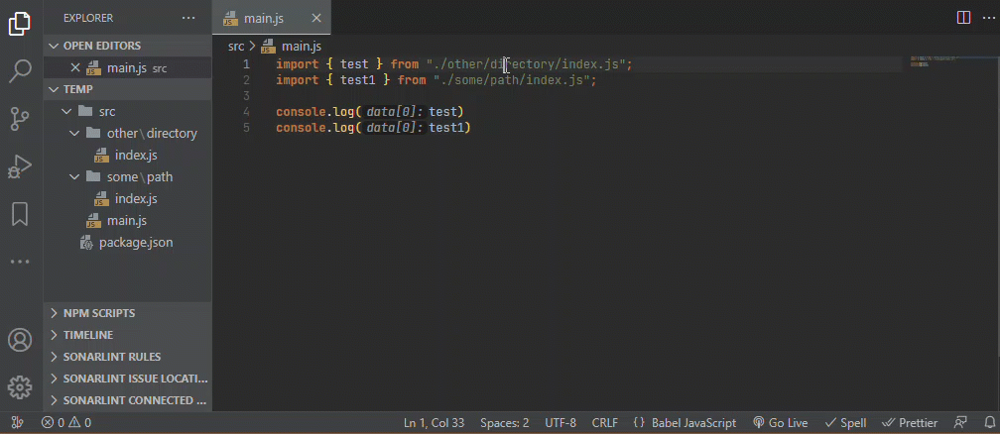

# go-to-file-with-path README

## Features

Go to file with the path which comes from your selection or the line the cursor at.

## Usage
1. Select a file path in the text editor or move cursor over the path.
2. `Ctrl | ⌘ + P`: fill the text of selection to `quickOpen` Panel.
3. `Enter` to confirm.

## Extension Settings

Customize your own shortcut by search `extension.goToFileWithPath` in `Keyboard Shortcuts` list.  
Default shortcut is `Ctrl + P`. It may conflict with the shortcut of `Go To File` command. If this extension dose not work properly, try to delete the shortcut of `Go To File` command.

## Release Notes

### 1.0.0

Initial release

**Enjoy!**
